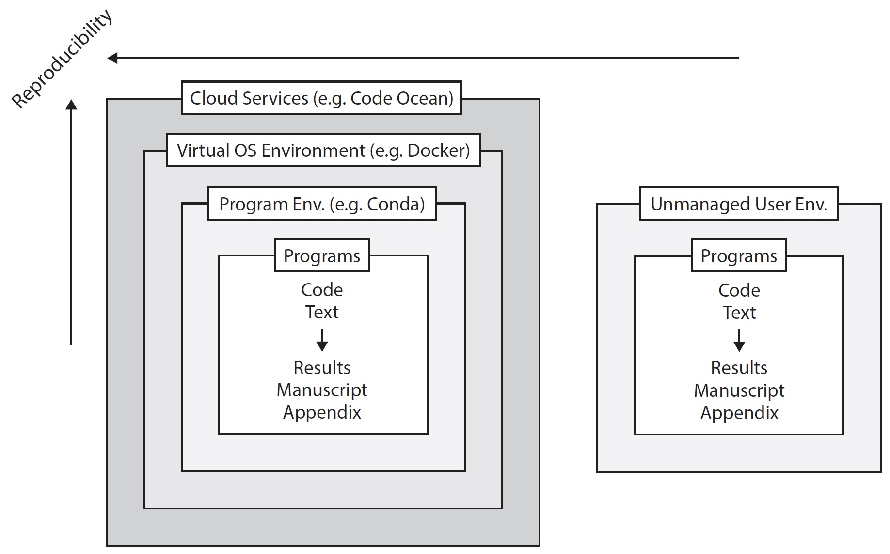

# Reproducibility

Your research should be reproducible by others. Not only has reproducibility become a requirement by many journals (see, e.g., the [data and code policy of the American Economic Association](https://www.aeaweb.org/journals/data/data-code-policy)), but it is good scientific practice to share all the necessary information on how you arrived at your exact results. Today, there are many tools available that facilitate the creation of reproducible environments for your research and allow to accomodate your individual preferences. That being said, working reproducibly will affect the way you work, and not all of your habits might go along well with the principles of open science.

This guide starts by describing the general requirements of reproducible environments. Then we present a selection of the tools of the trade one after another and describe their features. In the last section, we bring all these tools together and describe step-by-step how to set up a reproducible research project. If you are eager to just dive right into it, you can directly start with the [how-to](#how-to).

## Reproducible environments

The key goal of reproducibility is to enable anyone to reproduce your research to the last number. In essence, this means to avoid the _works-on-my-machine-error_ under any circumstances by capturing and providing all the necessary information on the environment in which you worked. Based on this information, the person wanting to reproduce your research should be able to set up the same environment and run your code. Several tools allow you to achieve exactly that, though differing in the level of control over the environment (see figure).

<figure>
    
    <figcaption>
        Schematic depiction of a reproducible vis-a-vis a non-reproducible environment.
    </figcaption>
</figure>
[...]

## Docker

## Anaconda

## Make

- Note on Travis

## How-To
